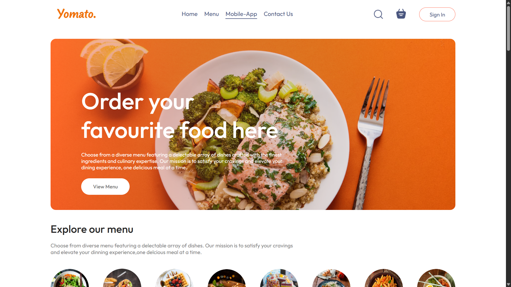
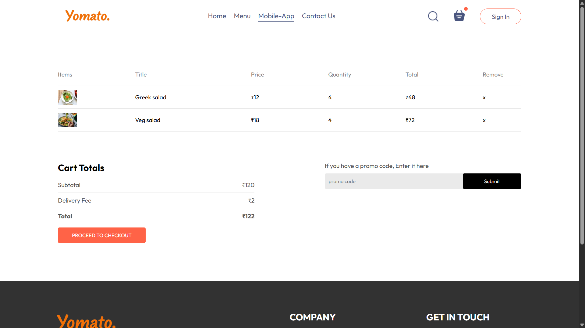

# 🛒 E-Commerce Food Ordering WebApp-Yomato

A fully responsive **E-Commerce Web Application** built with **React.js, Node.js, HTML, and CSS**.  
The app allows users to browse food categories, select items, add them to a cart, and view the total price dynamically.

---

## 🚀 Features
- 🍕 **Browse by Category** – Explore food items grouped by categories  
- 🛍️ **Add to Cart** – Add specific food items to the shopping cart  
- 💰 **Dynamic Price Calculation** – Cart automatically updates the total cost  
- 📱 **Responsive Design** – Works seamlessly on desktops, tablets, and mobile devices  
- ⚡ **Fast & Interactive** – Powered by React.js frontend with Node.js backend  

---

## 🛠️ Tech Stack
- **Frontend:** React.js, HTML5, CSS3  
- **Backend:** Node.js  
- **State Management:** React Hooks / Context API  
- **Styling:** CSS (Responsive Design)  

---

## 📸 Snapshots

| Homepage | Cart Page |
|----------|-----------|
|  |  |

---

## 📂 Project Structure
ecommerce-foodapp/
│── client/ # React.js frontend
│── assets/ # Images
│── public/ # Static files
│── package.json # Dependencies
│── README.md # Documentation


---

## ⚙️ Installation & Setup

1. **Clone the repository**
   ```bash
   git clone https://github.com/your-username/ecommerce-foodapp.git
   cd ecommerce-foodapp

2. Install dependencies
     ```bash
    cd client
    npm install

3. Run the development servers
     ```bash
     npm run dev

4. Open your browser at http://localhost:

🤝 Contributing

Contributions, issues, and feature requests are welcome!

📜 License

This project is licensed under the MIT License.

🌟 Show Your Support

If you like this project, give it a ⭐ to support the developer!
